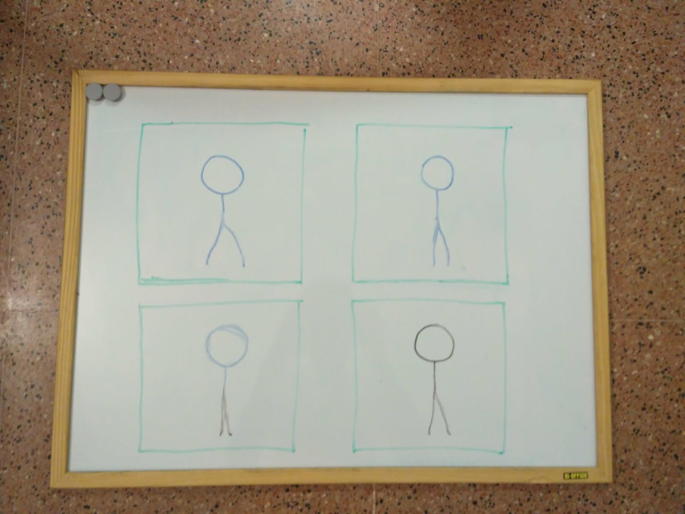

# ImageToAnimation

This script takes as input the image of a board, in witch they are, separated by rectangles, pictures of different
frames of an animation. From this image, a new one is generated in which has separated and ordered each of the frames.
The generated image is intended to be used to load an animation.

  
  

  

